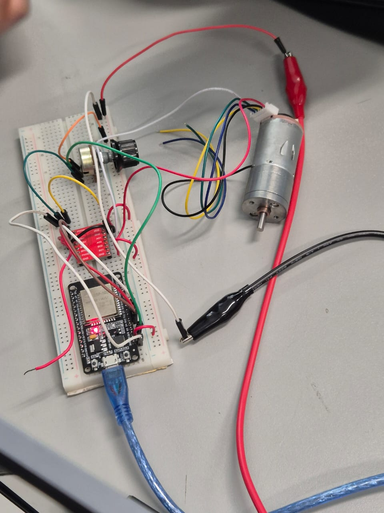

## 06_Task

En este ejercicio realizamos un programa para que la tarjeta hiciera varias tareas simlutaneas unas de ellas se encarga de leer el adc giro mientas que la otra utiliza los valores de lectura para contolar la velocidad y determinar el sentido del giro del motor

